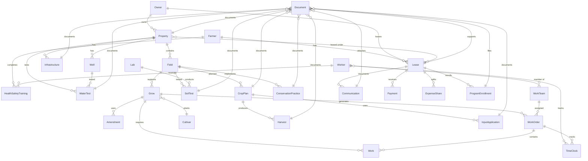

# Core Data Entities: What Farmers Need to Know

## Overview

The Materials and Practices app stores your farm information in organized records called "entities." Each entity holds specific types of information about your farm. This guide explains what each record type does and what information you need to enter.

## Farm Information You Enter

### Farmer Profile
**What it is**: Your personal and business information
**What you enter**:
- Your name and contact information
- Farm business name
- Phone number and email
- Profile photo (optional)
**Why it matters**: This information appears on reports and helps identify your farm in the system.

### Property Records  
**What it is**: Information about land you own or lease
**What you enter**:
- Property name (like "North Field" or "Main Farm")
- Address and location
- Total acres and how they're used (crops, pasture, woods)
- Whether you have irrigation
- Legal parcel numbers if known
**Why it matters**: Helps track which land is used for what and supports organic certification.

### Field Records
**What it is**: Individual areas within your properties where you grow crops
**What you enter**:
- Field name or number
- Size in acres
- Soil type information
- Whether there's drainage tile
- Field boundaries (using GPS if available)
**Why it matters**: Required for organic certification and helps plan crop rotations.

### Grow Records
**What it is**: Each time you plant something in a field
**What you enter**:
- What crop you're growing
- Where you planted it
- When you planted and expect to harvest
- Field manager contact info
- Any special notes about the growing season
**Why it matters**: Tracks the history of what was grown where - essential for organic certification.

### Worker Information
**What it is**: People who work on your farm
**What you enter**:
- Worker name and contact information
- Job title and hire date
- Emergency contact information
- Training certifications
- Whether they're currently employed
**Why it matters**: Required for food safety regulations and worker safety compliance.

### Time Tracking
**What it is**: Hours worked by each employee
**What you enter**:
- Clock in and clock out times
- Which work order they're working on
- Any notes about the work done
**Why it matters**: Needed for payroll, labor cost tracking, and overtime calculations.

### Work Orders
**What it is**: Specific jobs that need to be done
**What you enter**:
- Description of the work
- Which field or crop it's for
- Who should do the work
- When it's due
- Priority level (high, medium, low)
**Why it matters**: Helps organize farm work and track labor costs for different crops.

### Soil Test Results
**What it is**: Lab results from soil samples you submit
**What you enter**:
- Test date and which lab did the testing
- pH level and organic matter percentage
- Nutrient levels (phosphorus, potassium)
- Lab recommendations
**Why it matters**: Guides fertilizer and lime applications and supports organic certification.

### Plant Variety Information (Cultivars)
**What it is**: Details about the specific varieties of plants you grow
**What you enter**:
- Usually pre-loaded from USDA database
- You might add notes about performance
- Custom varieties not in the database
**Why it matters**: Helps plan planting dates and track variety performance.

### Soil Amendments
**What it is**: Record of fertilizers, compost, or other materials added to soil
**What you enter**:
- What material you applied
- How much you used
- When and where you applied it
- How many labor hours it took
**Why it matters**: Required for organic certification and helps track input costs.

## Business Records You Enter

### Lease Agreements
**What it is**: Rental agreements for land you lease
**What you enter**:
- Landowner information
- Property being leased
- Rent amount and payment schedule
- Lease start and end dates
**Why it matters**: Tracks rental obligations and generates tax documentation.

### Payments
**What it is**: Money paid for rent or other farm expenses
**What you enter**:
- Payment amount and date
- What the payment was for
- Payment method (check, cash, bank transfer)
**Why it matters**: Tracks cash flow and provides records for taxes.

### Owner Information
**What it is**: People who own land you lease
**What you enter**:
- Owner name and contact information
- Properties they own
- Preferred communication methods
**Why it matters**: Maintains good landlord relationships and contract management.

## Records the App Creates Automatically

### Laboratory Contacts
**What it tracks**: Testing labs you use for soil and water tests
**How it helps**: Stores lab contact info and tracks testing history

### Infrastructure Records  
**What it tracks**: Buildings, wells, and other farm structures
**How it helps**: Maintains facility records for insurance and compliance

### Document Storage
**What it tracks**: Files you upload like receipts, certificates, and photos
**How it helps**: Keeps all your farm documents organized in one place

### Water Test Results
**What it tracks**: Quality testing results for wells and irrigation water
**How it helps**: Documents water safety for food safety regulations

### Conservation Practices
**What it tracks**: Environmental practices like cover crops or buffer strips
**How it helps**: Supports eligibility for conservation programs

### Work Teams
**What it tracks**: Groups of workers assigned to specific tasks
**How it helps**: Organizes labor and tracks team productivity

## Tips for Data Entry

1. **Be Consistent**: Use the same names and spellings each time
2. **Add Details**: More information is better for organic certification  
3. **Save Often**: Enter information as soon as possible while it's fresh
4. **Take Photos**: Pictures of receipts, fields, and problems are very helpful
5. **Use Notes**: Add extra details that might be important later

The app is designed to make record-keeping easier while meeting all the requirements for organic certification and food safety regulations.

---

# Technical Documentation for Developers

## Core Data Schema Version 6

The MaterialsAndPractices app uses Core Data version 6 as its primary data persistence layer, featuring comprehensive farm management entities with CloudKit synchronization support. The schema encompasses 21 entities covering farm operations, worker management, cultivation tracking, and compliance documentation.

### Core Data Model Version History

- **Current Version**: MaterialsAndPractices 6.xcdatamodel
- **CloudKit Integration**: Enabled for cross-device synchronization
- **Migration Support**: Automatic migration between model versions
- **Fetch Indexing**: Optimized with strategic indexes for performance

## Entity Overview

### Core Farm Management Entities
| Entity | Primary Purpose | Key Relationships |
|--------|----------------|-------------------|
| **Farmer** | Farm operator profile | → Leases, HealthSafetyTrainings |
| **Property** | Land holdings | → Owner, Fields, Infrastructure, Leases |
| **Field** | Cultivation areas | → Property, Grows, SoilTests, CropPlans |
| **Grow** | Active cultivation tracking | → Field, Cultivar, WorkOrders, Amendments |
| **Cultivar** | Plant variety database | → Grows |

### Worker & Time Management Entities
| Entity | Primary Purpose | Key Relationships |
|--------|----------------|-------------------|
| **Worker** | Employee profiles | → TimeClock, WorkTeams, HealthSafetyTrainings |
| **TimeClock** | Time tracking system | → Worker, WorkOrder |
| **WorkTeam** | Team organization | → Workers, WorkOrders |
| **WorkOrder** | Task management | → Grow, WorkTeam, TimeClock, Work |
| **Work** | Individual work items | → Grow, WorkOrder |

### Agricultural Operations Entities
| Entity | Primary Purpose | Key Relationships |
|--------|----------------|-------------------|
| **Amendment** | Soil amendment tracking | → Grow |
| **SoilTest** | Soil analysis results | → Field, Lab |
| **WaterTest** | Water quality analysis | → Property, Well |
| **CropPlan** | Seasonal planning | → Field, Harvests, InputApplication |
| **Harvest** | Harvest record keeping | → CropPlan |

### Infrastructure & Compliance Entities
| Entity | Primary Purpose | Key Relationships |
|--------|----------------|-------------------|
| **Infrastructure** | Farm infrastructure | → Property |
| **Well** | Water source management | → Property, Field, WaterTests |
| **Lab** | Testing facilities | → SoilTests |
| **ConservationPractice** | Conservation compliance | → Field |
| **HealthSafetyTraining** | Safety compliance | → Farmer, Worker |

### Business & Documentation Entities
| Entity | Primary Purpose | Key Relationships |
|--------|----------------|-------------------|
| **Owner** | Land ownership | → Properties, Leases |
| **Lease** | Land lease agreements | → Owner, Farmer, Properties |
| **Document** | File attachments | → Multiple entities |
| **Communication** | Communication logs | → Lease |
| **Payment** | Financial transactions | → Lease |
| **ExpenseShare** | Expense allocation | → Lease |
| **ProgramEnrollment** | Government programs | → Lease |
| **InputApplication** | Input usage tracking | → CropPlan |

---

## Detailed Entity Specifications

### Farmer Entity
**Purpose**: Central farmer/operator profile with contact information and organizational details.

| Attribute | Type | Optional | Default | Description |
|-----------|------|----------|---------|-------------|
| id | UUID | Yes | - | Unique identifier |
| name | String | Yes | - | Farmer's full name |
| email | String | Yes | - | Email address |
| phone | String | Yes | - | Phone number |
| orgName | String | Yes | - | Organization name |
| notes | String | Yes | - | Additional notes |
| profilePhotoData | Binary | Yes | - | Profile photo |

**Relationships**:
- `healthSafetyTrainings` → HealthSafetyTraining (One-to-Many, Cascade)
- `leases` → Lease (One-to-Many, Nullify)

**Indexes**: byIdIndex, byNameIndex

---

### Property Entity
**Purpose**: Represents individual land properties with acreage breakdowns and geographic information.

| Attribute | Type | Optional | Default | Description |
|-----------|------|----------|---------|-------------|
| id | UUID | Yes | - | Unique identifier |
| displayName | String | Yes | - | Property display name |
| county | String | Yes | - | County location |
| state | String | Yes | - | State location |
| centerLat | Double | Yes | - | Latitude coordinate |
| centerLon | Double | Yes | - | Longitude coordinate |
| totalAcres | Double | No | 0.0 | Total property acreage |
| tillableAcres | Double | No | 0.0 | Cultivatable acreage |
| pastureAcres | Double | No | 0.0 | Pasture acreage |
| woodlandAcres | Double | No | 0.0 | Woodland acreage |
| wetlandAcres | Double | No | 0.0 | Wetland acreage |
| hasIrrigation | Boolean | No | NO | Irrigation availability |
| notes | String | Yes | - | Property notes |
| parcelNumbers | Transformable | Yes | - | Legal parcel identifiers |

**Relationships**:
- `owner` → Owner (Many-to-One, Nullify)
- `fields` → Field (One-to-Many, Cascade)
- `infrastructure` → Infrastructure (One-to-Many, Cascade)
- `leases` → Lease (Many-to-Many, Nullify)
- `documents` → Document (One-to-Many, Cascade)
- `waterTests` → WaterTest (One-to-Many, Cascade)
- `wells` → Well (One-to-Many, Cascade)

**Indexes**: byIdIndex, byDisplayNameIndex

---

### Field Entity
**Purpose**: Individual field management within properties, tracking acreage and cultivation details.

| Attribute | Type | Optional | Default | Description |
|-----------|------|----------|---------|-------------|
| id | UUID | Yes | - | Unique identifier |
| name | String | Yes | - | Field designation |
| acres | Double | No | 0 | Field acreage |
| hasDrainTile | Boolean | No | NO | Drainage tile presence |
| notes | String | Yes | - | Field-specific notes |
| photoData | Binary | Yes | - | Field photographs |
| polygonWKB | Binary | Yes | - | Geographic boundary data |
| soilMapUnits | Transformable | Yes | - | Soil type mapping |

**Relationships**:
- `property` → Property (Many-to-One, Nullify)
- `grows` → Grow (One-to-Many, Nullify)
- `soilTests` → SoilTest (One-to-Many, Cascade)
- `cropPlans` → CropPlan (One-to-Many, Cascade)
- `conservationPractices` → ConservationPractice (One-to-Many, Cascade)
- `wells` → Well (One-to-Many, Cascade)

**Indexes**: byIdIndex, byNameIndex

---

### Grow Entity
**Purpose**: Active cultivation tracking with comprehensive location and management information.

| Attribute | Type | Optional | Default | Description |
|-----------|------|----------|---------|-------------|
| title | String | Yes | - | Grow designation |
| timestamp | Date | Yes | - | Creation timestamp |
| plantedDate | Date | Yes | - | Planting date |
| harvestDate | Date | Yes | - | Actual harvest date |
| expectedHavestDate | String | Yes | - | Expected harvest timing |
| size | Double | Yes | 0.0 | Cultivation area |
| growType | String | Yes | - | Type of growing operation |
| locationName | String | Yes | - | Location identifier |
| address | String | Yes | - | Physical address |
| city | String | Yes | - | City location |
| county | String | Yes | - | County location |
| state | String | Yes | - | State location |
| zip | String | Yes | - | ZIP code |
| manager | String | Yes | - | Field manager name |
| managerPhone | String | Yes | - | Manager contact |
| propertyOwner | String | Yes | - | Property owner |
| propertyOwnerPhone | String | Yes | - | Owner contact |
| propertyType | String | Yes | - | Property classification |
| drivingDirections | String | Yes | - | Access directions |
| notes | String | Yes | - | Additional notes |

**Relationships**:
- `cultivar` → Cultivar (Many-to-One, Nullify)
- `field` → Field (Many-to-One, Nullify)
- `amendments` → Amendment (One-to-Many, Nullify)
- `work` → Work (One-to-Many, Nullify)
- `workOrders` → WorkOrder (One-to-Many, Cascade)

---

### Cultivar Entity
**Purpose**: Comprehensive plant variety database with growing characteristics and agricultural information.

| Attribute | Type | Optional | Default | Description |
|-----------|------|----------|---------|-------------|
| name | String | No | "" | Cultivar name |
| cultivarName | String | Yes | - | Specific cultivar designation |
| commonName | String | Yes | - | Common plant name |
| approvedCommonName | String | Yes | - | Standardized common name |
| family | String | Yes | - | Plant family |
| genus | String | Yes | - | Botanical genus |
| fruitName | String | Yes | - | Fruit designation |
| cultivarDescription | String | Yes | - | Detailed description |
| season | String | Yes | - | Growing season |
| growingDays | String | Yes | - | Days to maturity |
| transplantAge | String | Yes | - | Transplant timing |
| plantingWeek | String | Yes | - | Optimal planting week |
| bestPlantingDates | String | Yes | - | Recommended planting dates |
| bestHarvest | String | Yes | - | Optimal harvest timing |
| hardyZone | String | Yes | - | Cold hardiness zone |
| optimalZones | String | Yes | - | Optimal growing zones |
| usdaZoneList | String | Yes | - | USDA zone compatibility |
| weatherTolerance | String | Yes | - | Weather tolerance characteristics |
| soilConditions | String | Yes | - | Soil requirements |
| soilInfo | String | Yes | - | Additional soil information |
| growingAdvice | String | Yes | - | Cultivation guidance |
| greenhouseInstructions | String | Yes | - | Greenhouse growing tips |
| harvestInstructions | String | Yes | - | Harvest procedures |
| ripenessIndicators | String | Yes | - | Ripeness identification |
| pests | String | Yes | - | Common pest issues |
| amendments | String | Yes | - | Recommended amendments |
| emoji | String | Yes | - | Visual identifier |
| colorRGB | String | Yes | - | RGB color coding |
| iosColor | String | Yes | - | iOS color reference |

**Relationships**:
- `grows` → Grow (One-to-Many, Nullify)

---

### Worker Entity
**Purpose**: Employee management with contact information, position details, and safety tracking.

| Attribute | Type | Optional | Default | Description |
|-----------|------|----------|---------|-------------|
| id | UUID | Yes | - | Unique identifier |
| name | String | Yes | - | Worker name |
| position | String | Yes | - | Job position |
| email | String | Yes | - | Email address |
| phone | String | Yes | - | Phone number |
| hireDate | Date | Yes | - | Employment start date |
| isActive | Boolean | No | YES | Employment status |
| emergencyContact | String | Yes | - | Emergency contact name |
| emergencyPhone | String | Yes | - | Emergency contact phone |
| notes | String | Yes | - | Additional notes |
| profilePhotoData | Binary | Yes | - | Profile photo |

**Relationships**:
- `timeClockEntries` → TimeClock (One-to-Many, Cascade)
- `teams` → WorkTeam (Many-to-Many, Nullify)
- `healthSafetyTrainings` → HealthSafetyTraining (One-to-Many, Cascade)

**Indexes**: byIdIndex, byNameIndex

---

### TimeClock Entity
**Purpose**: Time tracking system with work order integration and weekly hour calculations.

| Attribute | Type | Optional | Default | Description |
|-----------|------|----------|---------|-------------|
| id | UUID | Yes | - | Unique identifier |
| date | Date | Yes | - | Work date |
| clockInTime | Date | Yes | - | Clock in timestamp |
| clockOutTime | Date | Yes | - | Clock out timestamp |
| hoursWorked | Double | Yes | - | Calculated hours |
| isActive | Boolean | No | NO | Currently clocked in |
| year | Integer 16 | Yes | - | Year for grouping |
| weekNumber | Integer 16 | Yes | - | Week number for grouping |
| notes | String | Yes | - | Time entry notes |

**Relationships**:
- `worker` → Worker (Many-to-One, Nullify)
- `workOrder` → WorkOrder (Many-to-One, Nullify)

**Indexes**: byIdIndex, byDateIndex, byWeekYearIndex

---

### WorkOrder Entity
**Purpose**: Task management system with team assignment, priority levels, and completion tracking.

| Attribute | Type | Optional | Default | Description |
|-----------|------|----------|---------|-------------|
| id | UUID | Yes | - | Unique identifier |
| title | String | Yes | - | Work order title |
| notes | String | Yes | - | Detailed description |
| priority | String | Yes | - | Priority level |
| status | String | Yes | - | Current status |
| createdDate | Date | Yes | - | Creation timestamp |
| dueDate | Date | Yes | - | Due date |
| completedDate | Date | Yes | - | Completion timestamp |
| isCompleted | Boolean | No | NO | Completion flag |
| totalEstimatedHours | Double | Yes | - | Estimated labor hours |

**Relationships**:
- `grow` → Grow (Many-to-One, Nullify)
- `assignedTeam` → WorkTeam (Many-to-One, Nullify)
- `workItems` → Work (One-to-Many, Cascade)
- `timeClockEntries` → TimeClock (One-to-Many, Nullify)

**Indexes**: byIdIndex, byStatusIndex, byCreatedDateIndex

---

### WorkTeam Entity
**Purpose**: Team organization for coordinated work assignments and labor management.

| Attribute | Type | Optional | Default | Description |
|-----------|------|----------|---------|-------------|
| id | UUID | Yes | - | Unique identifier |
| name | String | Yes | - | Team name |
| isActive | Boolean | No | YES | Team status |
| createdDate | Date | Yes | - | Creation date |
| notes | String | Yes | - | Team notes |

**Relationships**:
- `members` → Worker (Many-to-Many, Nullify)
- `workOrders` → WorkOrder (One-to-Many, Nullify)

**Indexes**: byIdIndex, byNameIndex

---

### Work Entity
**Purpose**: Individual work item tracking within work orders with practice association.

| Attribute | Type | Optional | Default | Description |
|-----------|------|----------|---------|-------------|
| name | String | Yes | "" | Work item name |
| practice | String | Yes | "" | Associated practice |
| practiceIndex | Integer 32 | Yes | 0 | Practice reference |
| jobCompleted | Boolean | Yes | NO | Completion status |
| jobCompleteTimestamp | Date | Yes | - | Completion time |

**Relationships**:
- `grow` → Grow (Many-to-One, Nullify)
- `workOrder` → WorkOrder (Many-to-One, Nullify)

---

### SoilTest Entity
**Purpose**: Soil analysis results with laboratory tracking and nutrient data.

| Attribute | Type | Optional | Default | Description |
|-----------|------|----------|---------|-------------|
| id | UUID | Yes | - | Unique identifier |
| date | Date | Yes | - | Test date |
| labName | String | Yes | - | Testing laboratory |
| ph | Double | Yes | - | pH level |
| omPct | Double | Yes | - | Organic matter percentage |
| p_ppm | Double | Yes | - | Phosphorus (ppm) |
| k_ppm | Double | Yes | - | Potassium (ppm) |
| cec | Double | Yes | - | Cation exchange capacity |
| recNotes | String | Yes | - | Recommendations |

**Relationships**:
- `field` → Field (Many-to-One, Nullify)
- `lab` → Lab (Many-to-One, Nullify)
- `document` → Document (One-to-One, Nullify)

**Indexes**: byIdIndex, byDateIndex

---

### Amendment Entity
**Purpose**: Soil amendment application tracking with labor hour recording.

| Attribute | Type | Optional | Default | Description |
|-----------|------|----------|---------|-------------|
| name | String | Yes | - | Amendment name |
| material | String | Yes | - | Material type |
| materialIndex | Integer 32 | Yes | 0 | Material reference |
| applicationDate | Date | Yes | - | Application date |
| laborHours | String | Yes | - | Labor hours required |
| notes | String | Yes | - | Application notes |

**Relationships**:
- `grow` → Grow (Many-to-One, Nullify)

---

## Entity Relationship Diagram



## Data Access Patterns

### Common Fetch Requests

#### Active Grows Query
```swift
@FetchRequest(
    entity: Grow.entity(),
    sortDescriptors: [
        NSSortDescriptor(keyPath: \Grow.field?.property?.displayName, ascending: true),
        NSSortDescriptor(keyPath: \Grow.title, ascending: true)
    ],
    predicate: NSPredicate(format: "harvestDate == nil"),
    animation: .default
)
private var activeGrows: FetchedResults<Grow>
```

#### Worker Time Tracking Query
```swift
@FetchRequest(
    entity: TimeClock.entity(),
    sortDescriptors: [NSSortDescriptor(keyPath: \TimeClock.date, ascending: false)],
    predicate: NSPredicate(format: "year == %d AND weekNumber == %d", year, week),
    animation: .default
)
private var weeklyTimeEntries: FetchedResults<TimeClock>
```

#### Work Order Status Query
```swift
@FetchRequest(
    entity: WorkOrder.entity(),
    sortDescriptors: [NSSortDescriptor(keyPath: \WorkOrder.createdDate, ascending: false)],
    predicate: NSPredicate(format: "isCompleted == NO"),
    animation: .default
)
private var activeWorkOrders: FetchedResults<WorkOrder>
```

## Performance Considerations

### Fetch Indexes
Strategic indexes are implemented for optimal query performance:

- **UUID-based lookups**: All entities have `byIdIndex`
- **Name-based searches**: Entities with names have `byNameIndex`
- **Date-based queries**: Time-sensitive entities have `byDateIndex`
- **Status filtering**: Status-driven entities have `byStatusIndex`
- **Composite indexes**: Complex queries use multi-field indexes (e.g., `byWeekYearIndex`)

### Relationship Optimization
- **Cascade deletions**: Child entities automatically deleted with parents
- **Nullify relationships**: Prevent orphaned records
- **Fetch batching**: Large datasets use batch fetching
- **Faulting**: Core Data automatic memory management

### CloudKit Synchronization
- **Automatic sync**: Changes propagate across devices
- **Conflict resolution**: Core Data handles merge conflicts
- **Schema evolution**: CloudKit schema updates with model versions
- **Security**: iCloud encryption for data protection

This comprehensive data structure supports all aspects of farm management while maintaining data integrity, performance, and scalability for growing agricultural operations.