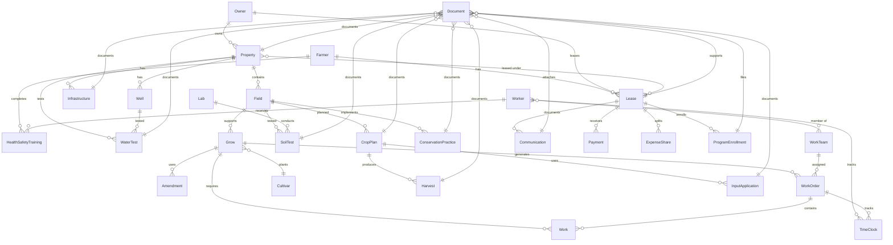

# MaterialsAndPractices Core Data Schema Documentation

## Overview

The MaterialsAndPractices app uses Core Data version 6 as its primary data persistence layer, featuring comprehensive farm management entities with CloudKit synchronization support. The schema encompasses 21 entities covering farm operations, worker management, cultivation tracking, and compliance documentation.

## Core Data Model Version History

- **Current Version**: MaterialsAndPractices 6.xcdatamodel
- **CloudKit Integration**: Enabled for cross-device synchronization
- **Migration Support**: Automatic migration between model versions
- **Fetch Indexing**: Optimized with strategic indexes for performance

## Entity Overview

### Core Farm Management Entities
| Entity | Primary Purpose | Key Relationships |
|--------|----------------|-------------------|
| **Farmer** | Farm operator profile | → Leases, HealthSafetyTrainings |
| **Property** | Land holdings | → Owner, Fields, Infrastructure, Leases |
| **Field** | Cultivation areas | → Property, Grows, SoilTests, CropPlans |
| **Grow** | Active cultivation tracking | → Field, Cultivar, WorkOrders, Amendments |
| **Cultivar** | Plant variety database | → Grows |

### Worker & Time Management Entities
| Entity | Primary Purpose | Key Relationships |
|--------|----------------|-------------------|
| **Worker** | Employee profiles | → TimeClock, WorkTeams, HealthSafetyTrainings |
| **TimeClock** | Time tracking system | → Worker, WorkOrder |
| **WorkTeam** | Team organization | → Workers, WorkOrders |
| **WorkOrder** | Task management | → Grow, WorkTeam, TimeClock, Work |
| **Work** | Individual work items | → Grow, WorkOrder |

### Agricultural Operations Entities
| Entity | Primary Purpose | Key Relationships |
|--------|----------------|-------------------|
| **Amendment** | Soil amendment tracking | → Grow |
| **SoilTest** | Soil analysis results | → Field, Lab |
| **WaterTest** | Water quality analysis | → Property, Well |
| **CropPlan** | Seasonal planning | → Field, Harvests, InputApplication |
| **Harvest** | Harvest record keeping | → CropPlan |

### Infrastructure & Compliance Entities
| Entity | Primary Purpose | Key Relationships |
|--------|----------------|-------------------|
| **Infrastructure** | Farm infrastructure | → Property |
| **Well** | Water source management | → Property, Field, WaterTests |
| **Lab** | Testing facilities | → SoilTests |
| **ConservationPractice** | Conservation compliance | → Field |
| **HealthSafetyTraining** | Safety compliance | → Farmer, Worker |

### Business & Documentation Entities
| Entity | Primary Purpose | Key Relationships |
|--------|----------------|-------------------|
| **Owner** | Land ownership | → Properties, Leases |
| **Lease** | Land lease agreements | → Owner, Farmer, Properties |
| **Document** | File attachments | → Multiple entities |
| **Communication** | Communication logs | → Lease |
| **Payment** | Financial transactions | → Lease |
| **ExpenseShare** | Expense allocation | → Lease |
| **ProgramEnrollment** | Government programs | → Lease |
| **InputApplication** | Input usage tracking | → CropPlan |

---

## Detailed Entity Specifications

### Farmer Entity
**Purpose**: Central farmer/operator profile with contact information and organizational details.

| Attribute | Type | Optional | Default | Description |
|-----------|------|----------|---------|-------------|
| id | UUID | Yes | - | Unique identifier |
| name | String | Yes | - | Farmer's full name |
| email | String | Yes | - | Email address |
| phone | String | Yes | - | Phone number |
| orgName | String | Yes | - | Organization name |
| notes | String | Yes | - | Additional notes |
| profilePhotoData | Binary | Yes | - | Profile photo |

**Relationships**:
- `healthSafetyTrainings` → HealthSafetyTraining (One-to-Many, Cascade)
- `leases` → Lease (One-to-Many, Nullify)

**Indexes**: byIdIndex, byNameIndex

---

### Property Entity
**Purpose**: Represents individual land properties with acreage breakdowns and geographic information.

| Attribute | Type | Optional | Default | Description |
|-----------|------|----------|---------|-------------|
| id | UUID | Yes | - | Unique identifier |
| displayName | String | Yes | - | Property display name |
| county | String | Yes | - | County location |
| state | String | Yes | - | State location |
| centerLat | Double | Yes | - | Latitude coordinate |
| centerLon | Double | Yes | - | Longitude coordinate |
| totalAcres | Double | No | 0.0 | Total property acreage |
| tillableAcres | Double | No | 0.0 | Cultivatable acreage |
| pastureAcres | Double | No | 0.0 | Pasture acreage |
| woodlandAcres | Double | No | 0.0 | Woodland acreage |
| wetlandAcres | Double | No | 0.0 | Wetland acreage |
| hasIrrigation | Boolean | No | NO | Irrigation availability |
| notes | String | Yes | - | Property notes |
| parcelNumbers | Transformable | Yes | - | Legal parcel identifiers |

**Relationships**:
- `owner` → Owner (Many-to-One, Nullify)
- `fields` → Field (One-to-Many, Cascade)
- `infrastructure` → Infrastructure (One-to-Many, Cascade)
- `leases` → Lease (Many-to-Many, Nullify)
- `documents` → Document (One-to-Many, Cascade)
- `waterTests` → WaterTest (One-to-Many, Cascade)
- `wells` → Well (One-to-Many, Cascade)

**Indexes**: byIdIndex, byDisplayNameIndex

---

### Field Entity
**Purpose**: Individual field management within properties, tracking acreage and cultivation details.

| Attribute | Type | Optional | Default | Description |
|-----------|------|----------|---------|-------------|
| id | UUID | Yes | - | Unique identifier |
| name | String | Yes | - | Field designation |
| acres | Double | No | 0 | Field acreage |
| hasDrainTile | Boolean | No | NO | Drainage tile presence |
| notes | String | Yes | - | Field-specific notes |
| photoData | Binary | Yes | - | Field photographs |
| polygonWKB | Binary | Yes | - | Geographic boundary data |
| soilMapUnits | Transformable | Yes | - | Soil type mapping |

**Relationships**:
- `property` → Property (Many-to-One, Nullify)
- `grows` → Grow (One-to-Many, Nullify)
- `soilTests` → SoilTest (One-to-Many, Cascade)
- `cropPlans` → CropPlan (One-to-Many, Cascade)
- `conservationPractices` → ConservationPractice (One-to-Many, Cascade)
- `wells` → Well (One-to-Many, Cascade)

**Indexes**: byIdIndex, byNameIndex

---

### Grow Entity
**Purpose**: Active cultivation tracking with comprehensive location and management information.

| Attribute | Type | Optional | Default | Description |
|-----------|------|----------|---------|-------------|
| title | String | Yes | - | Grow designation |
| timestamp | Date | Yes | - | Creation timestamp |
| plantedDate | Date | Yes | - | Planting date |
| harvestDate | Date | Yes | - | Actual harvest date |
| expectedHavestDate | String | Yes | - | Expected harvest timing |
| size | Double | Yes | 0.0 | Cultivation area |
| growType | String | Yes | - | Type of growing operation |
| locationName | String | Yes | - | Location identifier |
| address | String | Yes | - | Physical address |
| city | String | Yes | - | City location |
| county | String | Yes | - | County location |
| state | String | Yes | - | State location |
| zip | String | Yes | - | ZIP code |
| manager | String | Yes | - | Field manager name |
| managerPhone | String | Yes | - | Manager contact |
| propertyOwner | String | Yes | - | Property owner |
| propertyOwnerPhone | String | Yes | - | Owner contact |
| propertyType | String | Yes | - | Property classification |
| drivingDirections | String | Yes | - | Access directions |
| notes | String | Yes | - | Additional notes |

**Relationships**:
- `cultivar` → Cultivar (Many-to-One, Nullify)
- `field` → Field (Many-to-One, Nullify)
- `amendments` → Amendment (One-to-Many, Nullify)
- `work` → Work (One-to-Many, Nullify)
- `workOrders` → WorkOrder (One-to-Many, Cascade)

---

### Cultivar Entity
**Purpose**: Comprehensive plant variety database with growing characteristics and agricultural information.

| Attribute | Type | Optional | Default | Description |
|-----------|------|----------|---------|-------------|
| name | String | No | "" | Cultivar name |
| cultivarName | String | Yes | - | Specific cultivar designation |
| commonName | String | Yes | - | Common plant name |
| approvedCommonName | String | Yes | - | Standardized common name |
| family | String | Yes | - | Plant family |
| genus | String | Yes | - | Botanical genus |
| fruitName | String | Yes | - | Fruit designation |
| cultivarDescription | String | Yes | - | Detailed description |
| season | String | Yes | - | Growing season |
| growingDays | String | Yes | - | Days to maturity |
| transplantAge | String | Yes | - | Transplant timing |
| plantingWeek | String | Yes | - | Optimal planting week |
| bestPlantingDates | String | Yes | - | Recommended planting dates |
| bestHarvest | String | Yes | - | Optimal harvest timing |
| hardyZone | String | Yes | - | Cold hardiness zone |
| optimalZones | String | Yes | - | Optimal growing zones |
| usdaZoneList | String | Yes | - | USDA zone compatibility |
| weatherTolerance | String | Yes | - | Weather tolerance characteristics |
| soilConditions | String | Yes | - | Soil requirements |
| soilInfo | String | Yes | - | Additional soil information |
| growingAdvice | String | Yes | - | Cultivation guidance |
| greenhouseInstructions | String | Yes | - | Greenhouse growing tips |
| harvestInstructions | String | Yes | - | Harvest procedures |
| ripenessIndicators | String | Yes | - | Ripeness identification |
| pests | String | Yes | - | Common pest issues |
| amendments | String | Yes | - | Recommended amendments |
| emoji | String | Yes | - | Visual identifier |
| colorRGB | String | Yes | - | RGB color coding |
| iosColor | String | Yes | - | iOS color reference |

**Relationships**:
- `grows` → Grow (One-to-Many, Nullify)

---

### Worker Entity
**Purpose**: Employee management with contact information, position details, and safety tracking.

| Attribute | Type | Optional | Default | Description |
|-----------|------|----------|---------|-------------|
| id | UUID | Yes | - | Unique identifier |
| name | String | Yes | - | Worker name |
| position | String | Yes | - | Job position |
| email | String | Yes | - | Email address |
| phone | String | Yes | - | Phone number |
| hireDate | Date | Yes | - | Employment start date |
| isActive | Boolean | No | YES | Employment status |
| emergencyContact | String | Yes | - | Emergency contact name |
| emergencyPhone | String | Yes | - | Emergency contact phone |
| notes | String | Yes | - | Additional notes |
| profilePhotoData | Binary | Yes | - | Profile photo |

**Relationships**:
- `timeClockEntries` → TimeClock (One-to-Many, Cascade)
- `teams` → WorkTeam (Many-to-Many, Nullify)
- `healthSafetyTrainings` → HealthSafetyTraining (One-to-Many, Cascade)

**Indexes**: byIdIndex, byNameIndex

---

### TimeClock Entity
**Purpose**: Time tracking system with work order integration and weekly hour calculations.

| Attribute | Type | Optional | Default | Description |
|-----------|------|----------|---------|-------------|
| id | UUID | Yes | - | Unique identifier |
| date | Date | Yes | - | Work date |
| clockInTime | Date | Yes | - | Clock in timestamp |
| clockOutTime | Date | Yes | - | Clock out timestamp |
| hoursWorked | Double | Yes | - | Calculated hours |
| isActive | Boolean | No | NO | Currently clocked in |
| year | Integer 16 | Yes | - | Year for grouping |
| weekNumber | Integer 16 | Yes | - | Week number for grouping |
| notes | String | Yes | - | Time entry notes |

**Relationships**:
- `worker` → Worker (Many-to-One, Nullify)
- `workOrder` → WorkOrder (Many-to-One, Nullify)

**Indexes**: byIdIndex, byDateIndex, byWeekYearIndex

---

### WorkOrder Entity
**Purpose**: Task management system with team assignment, priority levels, and completion tracking.

| Attribute | Type | Optional | Default | Description |
|-----------|------|----------|---------|-------------|
| id | UUID | Yes | - | Unique identifier |
| title | String | Yes | - | Work order title |
| notes | String | Yes | - | Detailed description |
| priority | String | Yes | - | Priority level |
| status | String | Yes | - | Current status |
| createdDate | Date | Yes | - | Creation timestamp |
| dueDate | Date | Yes | - | Due date |
| completedDate | Date | Yes | - | Completion timestamp |
| isCompleted | Boolean | No | NO | Completion flag |
| totalEstimatedHours | Double | Yes | - | Estimated labor hours |

**Relationships**:
- `grow` → Grow (Many-to-One, Nullify)
- `assignedTeam` → WorkTeam (Many-to-One, Nullify)
- `workItems` → Work (One-to-Many, Cascade)
- `timeClockEntries` → TimeClock (One-to-Many, Nullify)

**Indexes**: byIdIndex, byStatusIndex, byCreatedDateIndex

---

### WorkTeam Entity
**Purpose**: Team organization for coordinated work assignments and labor management.

| Attribute | Type | Optional | Default | Description |
|-----------|------|----------|---------|-------------|
| id | UUID | Yes | - | Unique identifier |
| name | String | Yes | - | Team name |
| isActive | Boolean | No | YES | Team status |
| createdDate | Date | Yes | - | Creation date |
| notes | String | Yes | - | Team notes |

**Relationships**:
- `members` → Worker (Many-to-Many, Nullify)
- `workOrders` → WorkOrder (One-to-Many, Nullify)

**Indexes**: byIdIndex, byNameIndex

---

### Work Entity
**Purpose**: Individual work item tracking within work orders with practice association.

| Attribute | Type | Optional | Default | Description |
|-----------|------|----------|---------|-------------|
| name | String | Yes | "" | Work item name |
| practice | String | Yes | "" | Associated practice |
| practiceIndex | Integer 32 | Yes | 0 | Practice reference |
| jobCompleted | Boolean | Yes | NO | Completion status |
| jobCompleteTimestamp | Date | Yes | - | Completion time |

**Relationships**:
- `grow` → Grow (Many-to-One, Nullify)
- `workOrder` → WorkOrder (Many-to-One, Nullify)

---

### SoilTest Entity
**Purpose**: Soil analysis results with laboratory tracking and nutrient data.

| Attribute | Type | Optional | Default | Description |
|-----------|------|----------|---------|-------------|
| id | UUID | Yes | - | Unique identifier |
| date | Date | Yes | - | Test date |
| labName | String | Yes | - | Testing laboratory |
| ph | Double | Yes | - | pH level |
| omPct | Double | Yes | - | Organic matter percentage |
| p_ppm | Double | Yes | - | Phosphorus (ppm) |
| k_ppm | Double | Yes | - | Potassium (ppm) |
| cec | Double | Yes | - | Cation exchange capacity |
| recNotes | String | Yes | - | Recommendations |

**Relationships**:
- `field` → Field (Many-to-One, Nullify)
- `lab` → Lab (Many-to-One, Nullify)
- `document` → Document (One-to-One, Nullify)

**Indexes**: byIdIndex, byDateIndex

---

### Amendment Entity
**Purpose**: Soil amendment application tracking with labor hour recording.

| Attribute | Type | Optional | Default | Description |
|-----------|------|----------|---------|-------------|
| name | String | Yes | - | Amendment name |
| material | String | Yes | - | Material type |
| materialIndex | Integer 32 | Yes | 0 | Material reference |
| applicationDate | Date | Yes | - | Application date |
| laborHours | String | Yes | - | Labor hours required |
| notes | String | Yes | - | Application notes |

**Relationships**:
- `grow` → Grow (Many-to-One, Nullify)

---

## Entity Relationship Diagram



## Data Access Patterns

### Common Fetch Requests

#### Active Grows Query
```swift
@FetchRequest(
    entity: Grow.entity(),
    sortDescriptors: [
        NSSortDescriptor(keyPath: \Grow.field?.property?.displayName, ascending: true),
        NSSortDescriptor(keyPath: \Grow.title, ascending: true)
    ],
    predicate: NSPredicate(format: "harvestDate == nil"),
    animation: .default
)
private var activeGrows: FetchedResults<Grow>
```

#### Worker Time Tracking Query
```swift
@FetchRequest(
    entity: TimeClock.entity(),
    sortDescriptors: [NSSortDescriptor(keyPath: \TimeClock.date, ascending: false)],
    predicate: NSPredicate(format: "year == %d AND weekNumber == %d", year, week),
    animation: .default
)
private var weeklyTimeEntries: FetchedResults<TimeClock>
```

#### Work Order Status Query
```swift
@FetchRequest(
    entity: WorkOrder.entity(),
    sortDescriptors: [NSSortDescriptor(keyPath: \WorkOrder.createdDate, ascending: false)],
    predicate: NSPredicate(format: "isCompleted == NO"),
    animation: .default
)
private var activeWorkOrders: FetchedResults<WorkOrder>
```

## Performance Considerations

### Fetch Indexes
Strategic indexes are implemented for optimal query performance:

- **UUID-based lookups**: All entities have `byIdIndex`
- **Name-based searches**: Entities with names have `byNameIndex`
- **Date-based queries**: Time-sensitive entities have `byDateIndex`
- **Status filtering**: Status-driven entities have `byStatusIndex`
- **Composite indexes**: Complex queries use multi-field indexes (e.g., `byWeekYearIndex`)

### Relationship Optimization
- **Cascade deletions**: Child entities automatically deleted with parents
- **Nullify relationships**: Prevent orphaned records
- **Fetch batching**: Large datasets use batch fetching
- **Faulting**: Core Data automatic memory management

### CloudKit Synchronization
- **Automatic sync**: Changes propagate across devices
- **Conflict resolution**: Core Data handles merge conflicts
- **Schema evolution**: CloudKit schema updates with model versions
- **Security**: iCloud encryption for data protection

This comprehensive data structure supports all aspects of farm management while maintaining data integrity, performance, and scalability for growing agricultural operations.